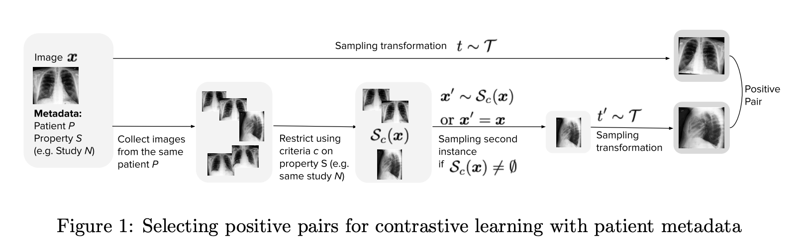

Repository referenced in the paper, ["MedAug: Contrastive learning leveraging patient metadata improves representations for chest X-ray interpretation"](https://static1.squarespace.com/static/59d5ac1780bd5ef9c396eda6/t/60fb3dd3fb74307c30c8c8bb/1627078099618/Camera_Ready_Paper.pdf), published in Machine Learning for Healthcare (MLHC) 2021.

### Table of Contents

- [Prerequisites](#prereqs)
- [Dataset](#dataset)
- [Pretrain MedAug model](#pretrain)
- [Fine-tune MedAug model](#fine-tune)
- [License](#license)
- [Citing](#citing)

---

<a name="prereqs"></a>

## Prerequisites

This program has been tested with Python 3.7.7.  To setup conda environment:
```
conda env create -f requirements.yml
conda activate medaug-env
```
<!-- Before starting, please create and activate a virutal environment, then install the repo Python requirements. To create a conda environment and install with pip,  please use the following commands:
```
conda create -n MedAug python=3.7.7
conda activate MedAug
pip install -r requirements.txt
``` -->
<!-- Alternatively, install the repo Python requirements using [poetry](https://python-poetry.org/docs/).  First point to the location of python 3.7.7, then go to the directory where `.toml` file is located to install the required packages and start the virtual environment. Specifically run the following commands:

```
poetry env use /path/to/python3.7.7
poetry install
poetry shell
``` -->

<a name="dataset"></a>

## Dataset

Please follow the [link](https://stanfordmlgroup.github.io/competitions/chexpert/) to download CheXpert dataset for the experiments.  We change the folder structure and save the file location in `processed_pretrain_w_lat_count.csv`.

<a name="pretrain"></a>

## Pretrain

Before pretrain, please make sure the path in the `processed_pretrain_w_lat_count.csv` is adjusted correctly.  

To pretrain with same-patient and same-study positive pairs and MoCo default negative pairs, go to `moco` folder and run the following commands: 

```
python main_moco.py -a resnet18 \
            --lr 0.0001 --batch-size 16 \
            --epochs 20 \
            --world-size 1 --rank 0 \
            --mlp --moco-t 0.2 --from-imagenet \
            --dist-url 'tcp://localhost:10001' --multiprocessing-distributed \
            --aug-setting chexpert --rotate 10 --maintain-ratio \
            --train_data processed_pretrain_w_lat_count.csv \
            --exp-name same_patient_same_study \
            --same-patient \
            --same-study

```

To explore a negative pair strategy, e.g. append 10\% additional negative pairs, run the following commands:

```
python main_moco.py -a resnet18 \
            --lr 0.0001 --batch-size 16 \
            --epochs 20 \
            --world-size 1 --rank 0 \
            --mlp --moco-t 0.2 --from-imagenet \
            --dist-url 'tcp://localhost:10001' --multiprocessing-distributed \
            --aug-setting chexpert --rotate 10 --maintain-ratio \
            --train_data processed_pretrain_w_lat_count.csv \
            --exp-name same_patient_same_study \
            --same-patient \
            --same-study \
            --hard-negative lateral \
            --append-hard-negative 0.1

```

The default location for saving checkpoints is under `./experiments` folder.


<a name="fine-tune"></a>

## Fine-tune
1. Setup conda environment for finetuning:
```
conda env create -f requirements.yml
conda activate medaug-env
```


2. Replace CheXpert dataset file paths:<br />
Replace `DATA_DIR` variable in `finetune/constants/constants.py` to location of 
your local CheXpert dataset, and replace file paths in `.csv` files in `label_fractions/` to 
location of images in your local CheXpert dataset. For each label fraction, five different training splits are provided in `label_fractions/` to enable repeated experiments and calculation of standard deviations.


3. Training:<br />
Replace `--ckpt_path` to location of the checkpoint from pretraining that you would like to use for finetuning. Replace `--train_custom_csv` with the location of the training split within `label_fractions/` you would like to use. Replace `--save_dir` with the directory where you would like best models from training to be saved. Within this directory, model checkpoints will be saved in a directory that will be created called `--experiment_name`.<br />
From within `finetune` directory run:
```
python train.py \
            --model ResNet18 \
            --num_epochs 256 \
            --iters_per_save 128 \
            --iters_per_eval 128 \
            --optimizer adam \
            --batch_size 16 \
            --custom_tasks pleural-effusion \
            --dataset chexpert-single-special \
            --metric_name chexpert-competition-single-AUROC \
            --normalization chexpert_norm \
            --lr 0.0003 \
            --fine_tuning module.fc.weight,module.fc.bias \
            --ckpt_path /path/to/checkpoint.tar \
            --train_custom_csv /path/to/label_fractions/train_csv_file \
            --val_custom_csv /path/to/label_fractions/valid.csv \
            --save_dir /path/to/save_dir \
            --experiment_name example \
            --pretrained true
```


4. Select ensemble model:<br />
Replace `--search_dir` to file path of directory specified by `--experiment_name` created by training. The checkpoints used for the ensemble model will be specified in `final.json` within the directory specified by `--search_dir`. From within `finetune` directory run:
```
python select_ensemble.py \
            --has_gpu true \
            --custom_tasks pleural-effusion \
            --search_dir /path/to/save_dir/example/
```


5. Testing:<br />
Replace `--test_csv` and `--test_image_paths` with location of `.csv` file within `label_fractions/` that you would like to use for testing. This file must be in the same format as `label_fractions/valid.csv`. We use the CheXpert test set - the labels for the CheXpert test set are not publicly released. Replace `--config_path` with the location of `final.json` from the previous step, and replace `--ckpt_path` with the location of `best.pth.tar` from within `--search_dir` from the previous step. Create a directory for saving test results and specify the location of this directory in `--save_dir`. From within `finetune` directory run:
```
python test.py \
            --test_csv /path/to/label_fractions/test_csv_file \
            --test_image_paths /path/to/label_fractions/test_csv_file \
            --custom_tasks pleural-effusion \
            --dataset chexpert-single-special \
            --config_path /path/to/save_dir/example/final.json \
            --ckpt_path /path/to/save_dir/example/best.pth.tar \
            --save_dir /path/to/save_dir/example/test_save \
            --phase test \
            --moco false \
            --together true
```
<!-- 
## Other Optional Arguments

--
-- -->

## Notes
For other CheXpert tasks, in `constants/constants.py` replace `CHEXPERT_SINGLE_TASKS` and `CHEXPERT_COMPETITION_SINGLE_TASKS`, and replace `--custom_tasks` in the above arguments. For example, for "Edema" classification, in `constants/constants.py` set
 ```
 CHEXPERT_SINGLE_TASKS = ["No Finding",
                         "Edema",
                        ]

CHEXPERT_COMPETITION_SINGLE_TASKS = ["Edema"]
 ``` 
 and for running `train.py`, `select_ensemble.py`, and `test.py` use
```
--custom_tasks edema
```

<a name="license"></a>

## License

This repository is made publicly available under the MIT License.

<a name="citing"></a>

## Citing

If you are using the MedAug, please cite this paper:
```
@article{vu2021medaug,
      title={MedAug: Contrastive learning leveraging patient metadata improves representations for chest X-ray interpretation}, 
      author={Vu, Yen Nhi Truong and Wang, Richard and Balachandar, Niranjan and Liu, Can and Ng, Andrew Y and Rajpurkar, Pranav},
      year={2021},
      journal={Machine Learning for Healthcare (MLHC)},
      volume={5},
      ages={1-14},
      year={2021}
}
```

